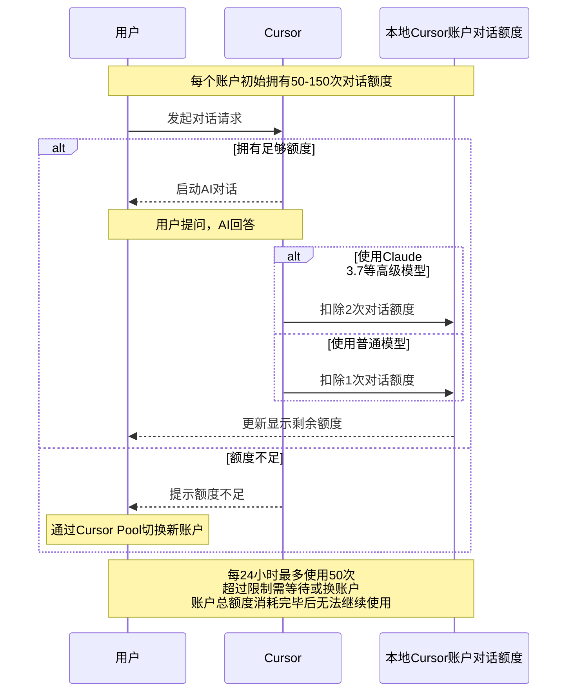
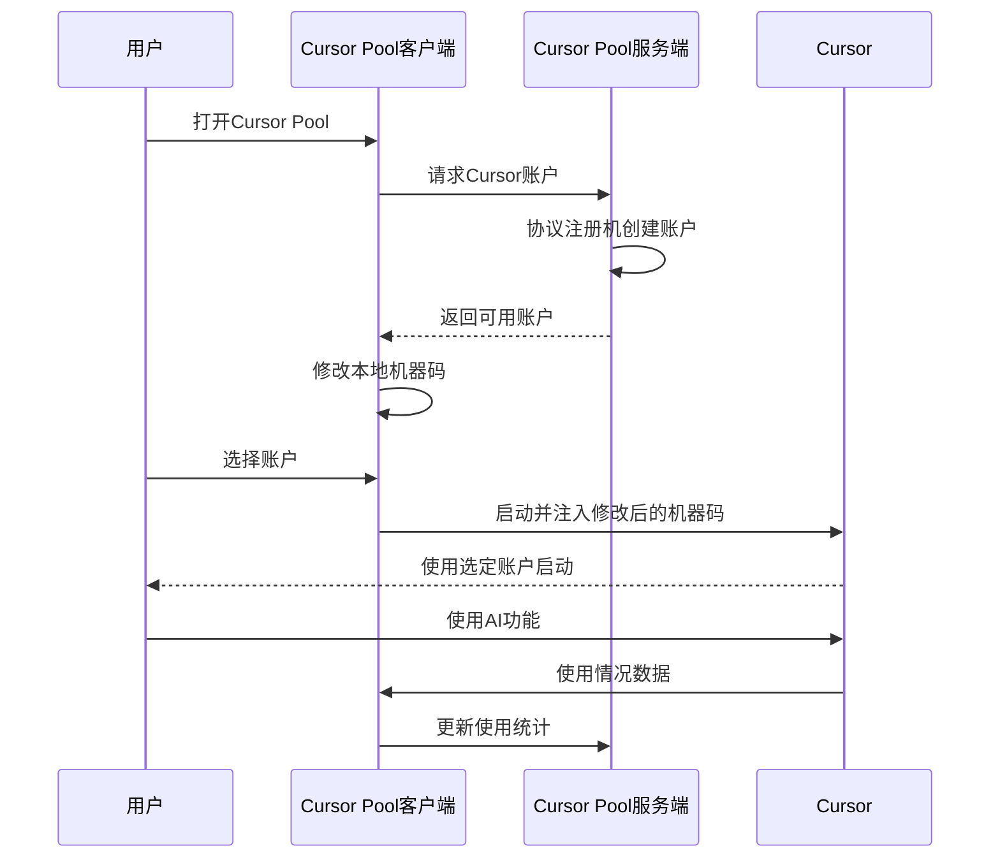

# 功能概览 :swimming_man:

快速开始使用Cursor Pool：
- [Windows安装教程](/guide/windows/installation)
- [macOS安装教程](/guide/macos/installation)

::: details 本地账户对话次数介绍 :speech_balloon:
* 云端下发的每个账户拥有50-150次对话额度
* 切换账户时消耗50点卡密额度
* 账户使用限制：每24小时最多50次对话(非固定时间重置)
* 卡密扣除的是保底对话次数，剩余次数可在接下来几天内继续使用
* 历史账户界面可追踪每个账户的使用状态和剩余额度

:::

::: details 工作原理 :gear:

:::
